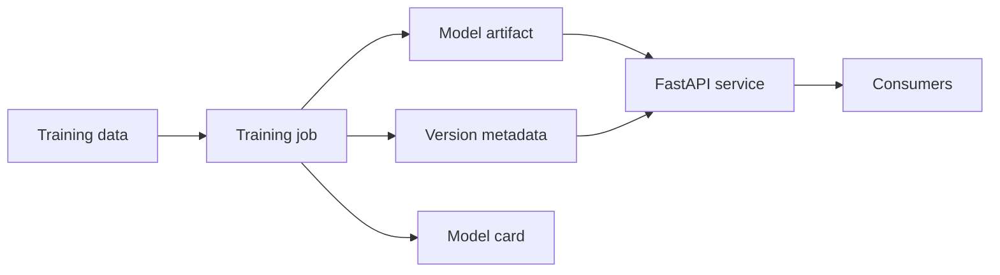

# Architecture

## Production notes

- Replace the built-in dataset with a versioned data source.
- Run training in a controlled environment.
- Promote models only after automated metric gates and human approval.
- Keep the serving image immutable and trace it back to source commit and model hash.
